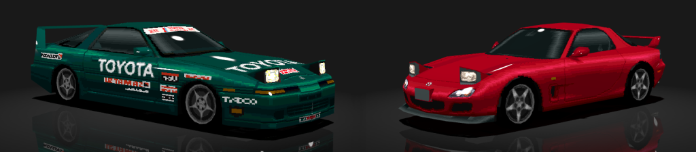

Obj viewer for GT2, based on threejs.

To view models from GT2, you'll need [to extract](../extract/) them.

## A possible setup

A static web server is required to run this app. Using address
[127.0.0.1](https://www.pcmag.com/encyclopedia/term/loopback-address) is
recommended, as it limits access to connections originating from the local
machine.

Install:

1. Install [node.js](https://nodejs.org/) for your platform.
2. `npm install -g http-server`

Run:

1. In the `gt2/view` folder run `http-server -a 127.0.0.1 -p 8080`
2. Navigate your browser to http://127.0.0.1:8080/main.html.

## Controls

W :  next model

S :  prior model

D :  next color palette

A :  prior color palette
